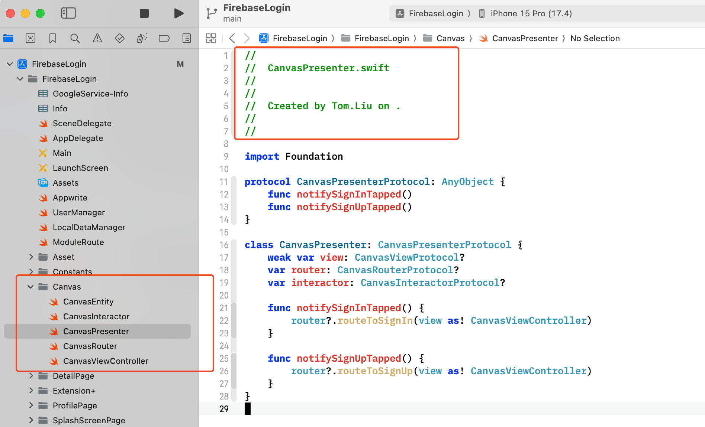

# MtTool

Generate OC/Swift files for project or module.

Free your time, focus on real coding things.

## Usage

For viper module

`mt_tool generateViperModule Canvas Tom.Liu ./`

## Debug

## Installation

Install the gem and add to the application's Gemfile by executing:

    $ bundle add mt_tool

If bundler is not being used to manage dependencies, install the gem by executing:

    $ gem install mt_tool

## Development

After checking out the repo, run `bin/setup` to install dependencies. You can also run `bin/console` for an interactive prompt that will allow you to experiment.

To install this gem onto your local machine, run `bundle exec rake install`. To release a new version, update the version number in `version.rb`, and then run `bundle exec rake release`, which will create a git tag for the version, push git commits and the created tag, and push the `.gem` file to [rubygems.org](https://rubygems.org).

## Contributing

Bug reports and pull requests are welcome on GitHub at https://github.com/lylelh/mt_tool.
